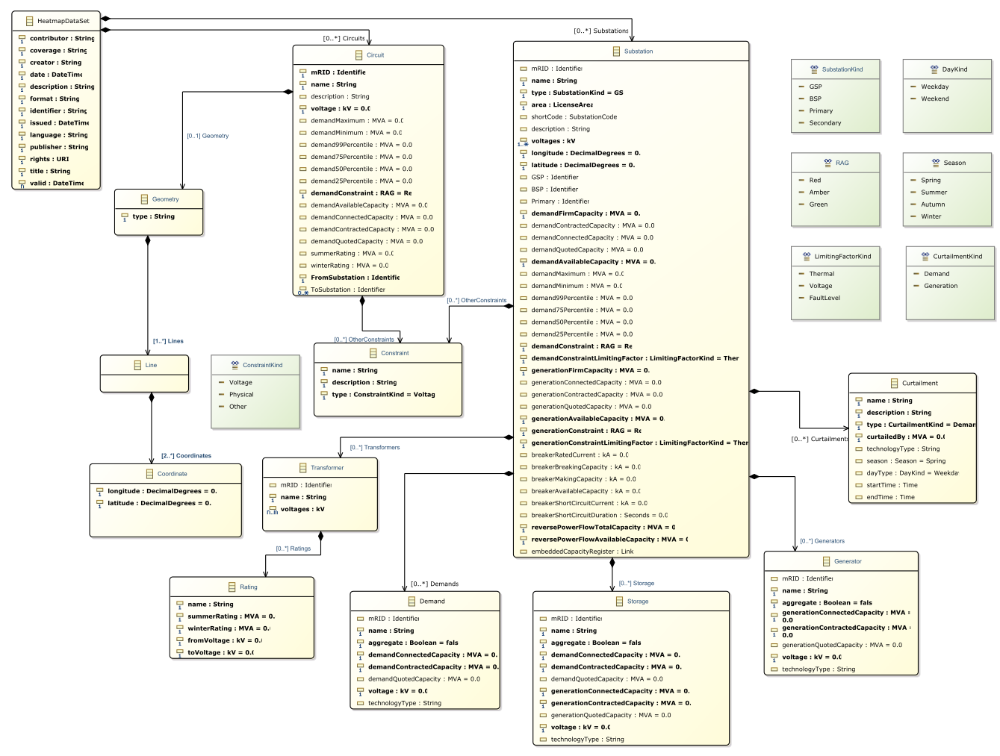

# Network Heatmaps API 

This is the documentation and examples for the proposed heatmap data standard network operators being developed by [Ofgem](https://www.ofgem.gov.uk/) under the [LTDS](https://www.ofgem.gov.uk/publications/next-steps-our-reforms-long-term-development-statement-ltds-and-key-enablers-dso-programme-work) reforms.

## OpenAPI 3.0

The [API Documentation](./api-docs) provides a [YAML](https://github.com/opengridsystems/network-heatmaps-api/blob/main/api-docs/heatmap-openapi.yaml) file defining the elements and attributes. 

The HeatmapDataSet attributes are taken from the [Dublin Core](https://www.dublincore.org) [Metadata Terms](https://www.dublincore.org/specifications/dublin-core/dcmi-terms/) and include the corresponding URIs

## Class Diagram

The [class diagram](./documentation/Heatmap%20Data%20Class%20Diagram%20-%20Latest.pdf) shows the relationships between the classes.

## Excel Definition

The elements and definitions were initially developed with an [Excel Spreadsheet](./documentation/Heatmap%20Data%20Definitions%20-%20Latest.xlsx) which includes all the documentation, element types, and attributes.

## Sample Data

Sample data has been provided, derived from public [network demand & generation capacity](https://network-maps.ssen.co.uk/) data supplied by [SSEN](https://www.ssen.co.uk/).

The data set used in this sample data is **not** current, and reflects a historical set.  It also contains two example circuits in the Perth area that are included for illustrativen purposes.

The data is available as:
- [JSON](./sample-data/sample-data.json)
- [Excel XSLX](./sample-data/sample-data.xlsx)

Both files are derived from the same source.  The only additional data in the JSON not included in the Excel file is the line routing data for the example circuits.

# Attribution & Licensing

The sample data is &copy; Copyright 2022 Scottish & Southern Electricity Networks
The documentation is made available under the [Open Government License 3.0](https://www.nationalarchives.gov.uk/doc/open-government-licence/version/3/)
